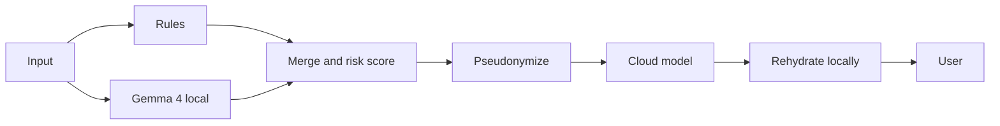

# Airlock

> A local privacy-assistance layer that reduces private data exposure when using cloud AI.

## Team

**Team Name:** Supes MLH Hack

| Member | Contribution |
| ------ | ------------ |
| Rahul R R | Gemma 4 integration, backend pipeline, and cloud model client |
| Harish B | Repository setup, documentation, demo samples, and evaluation data |
| Vishal M | Frontend experience and integration |
| Teammate A | Deterministic rules, risk scoring, and tests |

## Problem Statement

### The Problem

People paste customer details, credentials, internal addresses, medical information, and financial data into cloud AI tools every day. Banning AI loses productivity, while allowing unrestricted pasting sends sensitive information outside the organisation. Regex filters catch obvious emails and keys but miss context such as a named customer deal or diagnosis.

### Why We Chose This Problem

AI is useful precisely where private context matters. We wanted a practical local privacy-assistance layer that reduces exposure without asking people to give up their preferred cloud model.

## Solution

Airlock is a local privacy gateway between private prompts and cloud AI. Deterministic rules catch high-confidence patterns, while Gemma 4 runs locally to detect context-sensitive entities. Airlock merges the findings, replaces sensitive values with typed placeholders, sends only the sanitized prompt to the cloud, and rehydrates safe placeholders in the answer locally.

### Key Features

- Two-tier detection: deterministic rules plus local, contextual Gemma 4 detection.
- Typed, numbered placeholders preserve context for the cloud model.
- Stable identity mapping within a scan session.
- Local rehydration for non-secret entities; credentials, cards, and IDs remain redacted.
- Rules-only fallback when Gemma is unavailable.

## Innovation and Differentiation

Airlock uses a small open-weight model as a local gatekeeper rather than sending raw text to a hosted scanner. It combines certainty from rules with contextual understanding from Gemma, while typed placeholders let the cloud model do useful work without seeing the original values.

## Technical Implementation

### Architecture



### Technology Stack

| Category | Technologies |
| -------- | ------------ |
| Frontend | Next.js, React, TypeScript, Tailwind |
| Backend | FastAPI, Python |
| Database | N/A |
| AI / ML | Gemma 4 E2B IT via Foundry Local (local, open-weight) plus a cloud model API receiving sanitized text only |
| Infrastructure | Local machine / LAN |
| APIs / Services | Foundry Local SDK and a cloud model API |

### How It Works

The backend receives a prompt and runs the deterministic detector and local Gemma detector. It merges non-overlapping findings, assigns risk, and creates a stable placeholder map. Only the sanitized prompt is sent to the cloud model. The returned answer is rehydrated locally for pseudonymized entities; secrets are never restored.

### Technical Decisions

Rules handle high-confidence patterns such as emails, keys, IP addresses, and cards. Gemma handles context-only information such as people, organisations, diagnoses, salaries, and project names. The local model is loaded at startup and guarded so a single model instance processes one inference at a time. The system can still return rule findings when Gemma is disabled or unavailable.

## Implementation During the Hackathon

The team is building the Airlock scan, sanitization, cloud-question, and local rehydration flow during the Hack Day. Before the event we had a small Gradio app for benchmarking Gemma 4 locally; `backend/gemma.py` reuses its Foundry Local model-loading logic, and that pre-event app has been removed from the repo rather than presented as new work.

### Team Contributions

- **Rahul R R:** Gemma 4 integration, backend pipeline, and cloud model client.
- **Harish B:** Repository setup, documentation, demo samples, and evaluation data.
- **Vishal M:** Frontend experience and integration.
- **Teammate A:** Deterministic rules, risk scoring, and tests.

### Challenges and Learnings

TODO — document the measured Gemma latency, detection trade-offs, and lessons from the demo after the team has completed evaluation.

## Working Application

**Live Application:** TODO — add live/demo link after deployment.

The local application provides a single flow for scanning a prompt, inspecting detected entities and sanitized text, and asking a cloud model safely. It can run over a LAN so a teammate's frontend can use the backend host.

## Demo Video

**Demo Video:** TODO — add demo video link.

The planned demonstration scans the customer escalation sample offline, shows typed placeholders, sends only sanitized text to the cloud, and displays the locally rehydrated response.

## Open Source and AI Usage

### AI / Models

- **Gemma 4 E2B IT:** Apache 2.0, Google. Runs locally through Foundry Local to detect context-sensitive private entities before any cloud request.
- **Cloud model:** Receives sanitized text and typed placeholders; missed detections can still expose sensitive content, so Airlock does not guarantee complete protection.

### Open Source Components

- **FastAPI:** MIT-licensed Python web framework used for the backend API.
- **Next.js:** MIT-licensed React framework used for the frontend.
- **Foundry Local SDK:** Runs the local Gemma model.

External components remain attributed here; Airlock is a local privacy-assistance layer, not a claim of perfect detection or guaranteed anonymity.

## Setup and Usage

### Prerequisites

- Python 3 and Node.js/npm.
- Foundry Local and Gemma 4 for local contextual detection (optional; rules-only mode works without it).
- A configured cloud model API endpoint and key for `/ask`.

### Installation

```bash
git clone https://github.com/vishalm342/Supes_MLH_Hack.git
cd Supes_MLH_Hack

# backend (Python 3.11+)
python -m venv .venv
.venv\Scripts\activate                 # Windows (PowerShell); use `source .venv/bin/activate` on macOS/Linux
pip install -r backend/requirements.txt

# frontend (Node.js 18.18+)
cd frontend && npm install && cd ..
```

### Environment Variables

The backend reads `.env` at the repo root; the frontend reads `frontend/.env.local`.

```bash
cp .env.example .env                              # Windows: copy .env.example .env
cp frontend/.env.example frontend/.env.local      # Windows: copy frontend\.env.example frontend\.env.local
```

| File | Variable | Purpose |
|---|---|---|
| `.env` | `CLOUD_BASE_URL`, `CLOUD_API_KEY`, `CLOUD_MODEL` | Any OpenAI-compatible `/chat/completions` endpoint. Needed for **Ask Safely**. |
| `.env` | `GEMMA_ENABLED` | `true` loads Gemma 4 at startup (~47 s); `false` runs rules-only. |
| `.env` | `GEMMA_MODEL_ALIAS` | Foundry Local alias, default `gemma-4-e2b-it`. |
| `frontend/.env.local` | `NEXT_PUBLIC_API_URL` | Backend URL, default `http://localhost:8000`. |
| `frontend/.env.local` | `NEXT_PUBLIC_USE_MOCK` | `true` uses built-in mock responses instead of the backend. |

Never commit `.env` or `.env.local`.

### Running the Project

Run each in its own terminal, from the repo root:

```bash
# 1. backend — wait for "Application startup complete" (Gemma loads first when enabled)
uvicorn backend.main:app --host 0.0.0.0 --port 8000

# 2. frontend — then open http://localhost:3000
cd frontend && npm run dev -- -H 0.0.0.0
```

To run without Gemma, set `GEMMA_ENABLED=false` in `.env` and restart the backend.

Teammates can point their frontend at Rahul's backend by setting `NEXT_PUBLIC_API_URL=http://<rahul-lan-ip>:8000` in `frontend/.env.local`.

### End-to-end smoke test

With the backend running, this scans every sample in `samples/demo_samples.json`, sends the first one through `/ask`, and checks that no detected value reached the cloud and that redacted values never come back:

```bash
python -m backend.smoke_test                     # add --no-cloud if no cloud key is set
pytest backend/tests                             # rule and risk unit tests (pip install -r backend/requirements-dev.txt)
```

### Usage

Open the frontend, paste a private prompt, and scan it locally. Review the entities and sanitized text, then ask safely. The cloud response is rehydrated locally where appropriate. TODO — add measured latency and evaluation results.

## Devpost Submission

**Devpost Project:** TODO — add Devpost project link.

TODO — complete the MLH/OrganizerHQ submission and select the Best Use of Gemma 4 challenge.

## Credits and License

### Credits

Thanks to Google for Gemma 4, the Foundry Local project, FastAPI, Next.js, and the Hacktoberfest Hack Day — Coimbatore organizers.

### License

Apache License 2.0. See [LICENSE](./LICENSE).

## Submission Checklist

- [x] Project title and description added
- [x] All currently known team members listed
- [x] Problem clearly explained
- [x] Reason for choosing the problem explained
- [x] Solution and key features documented
- [x] Innovation and differentiation explained
- [x] Architecture included
- [x] Technical implementation documented
- [x] Work completed during the hackathon documented
- [x] Team contributions documented
- [ ] Working application is functional
- [ ] Live application link added where applicable
- [ ] Demo video added
- [x] AI and open-source components documented
- [ ] Setup and usage instructions tested
- [ ] Challenges and learnings documented
- [ ] Devpost submission completed
- [ ] Devpost link added
- [x] Credits added
- [x] License added
- [x] Repository is organized and complete

TODO — record real latency numbers, evaluation results, and challenges/learnings after the demo.
# Supes_MLH_Hack

Project for the MLH hackathon.
